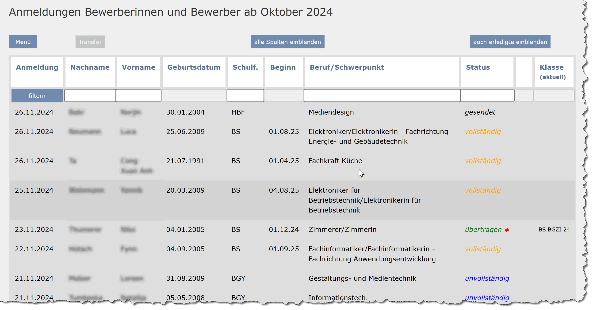

# dsa-verwaltung
Die *Digitale Schüleranmeldung* (DSA) ist ein WebTool zur Verwaltung digitaler Schüleranmeldungen an BBSn mit edoo.sys RLP.

Das Gesamtprojekt besteht aus 2 Repositorys für 2 Server:
- [github.com/fieser/dsa-formular](github.com/fieser/dsa-formular)
- [github.com/fieser/dsa-anmeldung](github.com/fieser/dsa-anmeldung)

Diese README.md berücksichtigt beide Repositorys.

## Funktionen

- Dynamisches Anmeldeformular basierend auf den SVP-Daten Ihrer Schule
- Upload von Bewerbungsunterlagen
- Verwaltung der Anmeldungen und Abgleich mit *edoo.sys RLP*
- Sammelimport in *edoo.sys RLP*

Die DSA ist unter der General Public License veröffentlicht und kostenfrei.
Eine [detailierte Funktionsbeschreibung][def] und eine Sammlung von [Screenshots][def] finden Sie im Wiki.

## Installation
Die Installation erfolgt auf zwei kommunizierenden Webservern. Eine [Anleitung zur Installation][def]befindet sich ebenfalls im Wiki.

## Lizenz
Dieses Projekt steht unter der GNU General Public License v3.0 (GPLv3). Weitere Informationen finden Sie in der Datei [LICENSE](./LICENSE.txt).

[def]: https://github.com/fieser/dsa-verwaltung/wiki