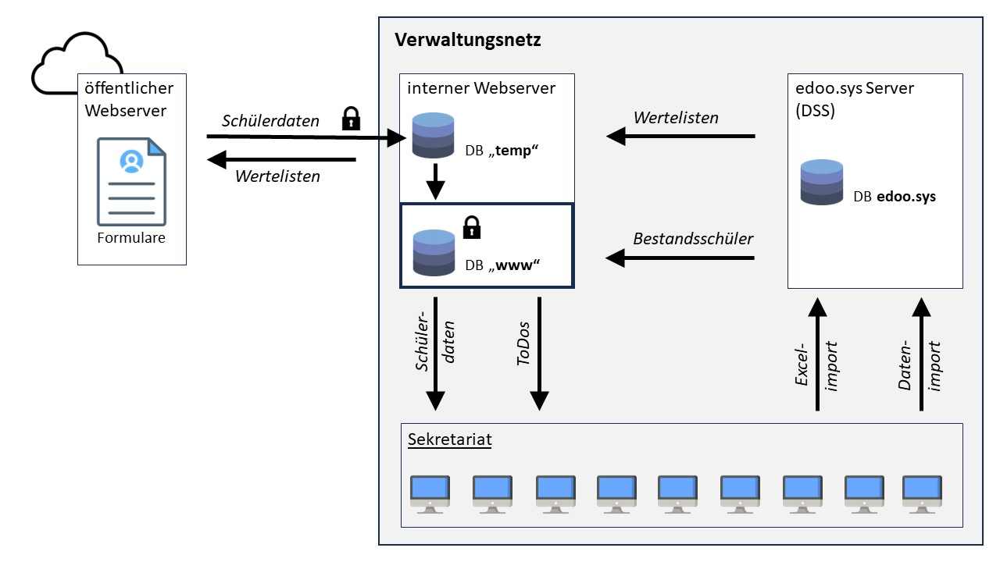

# dsa-verwaltung
Verwaltungstool zur Verwaltung digitaler Schüleranmeldungen an BBS für edoo.sys RLP

Das Gesamtprojekt besteht aus 2 Repositorys für 2 Server:
- [github.com/fieser/dsa-formular](github.com/fieser/dsa-formular)
- [github.com/fieser/dsa-anmeldung](github.com/fieser/dsa-anmeldung)

Diese README.md berücksichtigt beide Repositorys.

<h2>Umgesetzte Funktionen</h2>

<ul>
<li>Anmeldeformular mit edoo.sys-Wertelisten</li>
<li>Auswahl des Ausbildungsbetriebes</li>
<li>Automatische Generierung der Liste an der Schule verfügbarer Ausbildungsberufe</li>
<li>Automatische Generierung der Liste der den Beruf ausbildenden Ausbildungsbetriebe</li>
<li>Vorausgefüllte Felder bei weiterenn Anmeldungen</li>
<li>Plausibilisierungen von höchst. all. Abschluss, Schulform, Geburtsdatum usw.</li>
<li>Vermeidung Doppelter Anmeldungen für eine Schulform</li>
<li>Priorisierung mehrerer Anmeldungen für unterschiedlicher Schulformen</li>
<li>Generierung eines Anschreibens als PDF-Datei zur Zusendung der Bewerbungsunterlagen</li>
<li>Upload von Bewerbungsdokumenten (bei der Anmeldung und zu einem späteren Zeitpunkt)</li>

<li>Liste eingegangener Anmeldungen</li>
<li>Filterung und Sortierung</li>
<li>Ein-/Ausblenden fertig bearbeiteter und fehlerfreier Datensätze</li>
<li>Datensatzansicht (Registerkarten analog zu edoo.sys RLP)</li>
<li>Anzeige hochgeladener Bewerbungsunterlagen</li>
<li>Regelmäßiger Abgleich mit edoo.sys-Daten</li>
<li>Generierung einer ToDo-Liste mit fehlenden Einträgen und Eingabefehlern</li>
<li>Automatische Anpassung des Anmeldestatus</li>

<li>Automatische Verlinkung von Anmeldungen an mehreren Schulformen</li>
<li>Registrierung fehlender Anmeldeunterlagen</li>
<li>Notizmöglichkeit für jede eingegangene Anmeldung</li>
<li>Einfache Kontaktaufnahem per E-Mail</li>

<li>Generierung der Import-Excel-Datei für edoo.sys</li>
<ul>
	<li>Es werden jeweils die aktuell gefiltereten Datensätze mit Status <i>vollständig</i> exportiert.</li>
	<li>Weil die eingegangenen Anmeldungen regelmäßig mit edoo.sys verglichen werden, werden niemals bereits erfasste Daten exportiert.
		<br>Außerdem verhindert die Import-Schnittstelle von edoo.sys den Import doppelter SuS.</li>
	<li>Die Bewerber werden den in edoo.sys angelegten Bewerbungszielen zugeordnet.<br>
		Aus diesen gerneriert sich auch automatisch die Auswahlliste im Anmeldeformular.</li>
	<li>Leider können über die für edoo.sys vorgegebene Excel-Datei nicht alle Daten importiert werden.<br>
		Alle Daten betreffend des Ausbildungsverhältnisses müssen händisch ergänzt werden.<br>
		Dabei unterstützt und überprfüft aber die Funkton <i>ToDo-Liste</i></li>
	</ul>

</ul>

<h2>Geplante Funktionen</h2>

<ul>
<li>Abschluss der Bewerbungsphase (mit Löschung der Daten nicht eingeschulter SuS)</li>
<li>Einrichten der nächsten Bewerbungsphase</li>
<li>Abfrage des Bearbeitungsstatus für Schüler, Eltern und Betriebe</li>
<li>Schulformabhängige Auswahlliste für höchst. allg. Abschluss</li>
</ul>

<h2>Infrastruktur</h2>
<ul>
<li><b>edoo.sys DSS</b> (bereits vorhanden)</li>
	<ul>
	<li>Zeitgesteuerter Export von Wertelisten und Schülerdaten</li>
	<li>Zeitgesteuerter Transfer von Wertelisten zum öffentlichen Webserver</li>
	<li>Zeitgesteuerter Transfer von Schülerdaten zum internen Webserver</li>
	</ul>

<li><b>Öffentlicher Webserver</b> (Apache/MySQL/PHP) mit Anmeldeformular</li>
	<ul>
	<li>Bereitstellung des Formulars</li>
	<li>Liest und beschreibt Datenbank des internen Servers</li>
	</ul>

<li><b>Interner Webserver</b> (Apache/MySQL/PHP) für Sekretariatszugriff</li>
	<ul>
	<li>Weboberfläche für die Schulverwaltung</li>
	<li>Speicherung der Anmeldedaten</li>
	<li>Zeitgesteuerte Abgleich der Anmeldedaten mit den Daten vom DSS erhaltenen Schülerdaten</li>
	</ul>

</ul>



<h1>Hinweise zur Installation</h1>


<h2>Interner Webserver</h2>
<p>Kern des Sytems ist der interne Webserver. Das kann z.B., wie bei uns, eine VM mit einem Linux sein.</p>

>[Installationsskript für Ubuntu 24.04.1 LTS](https://github.com/fieser/dsa-verwaltung/wiki/Installationsskript-f%C3%BCr-Ubuntu-Server-24.04.1-LTS)


1. Installieren und konfigurieren Sie einen Webserver (Apache, PHP und MySQL)
2. Installieren Sie optional das Tool <i>phpMyAdmin</i>, das die Verwaltung der Datenbank deutlich erleichtert.
3. Clonen Sie das Github-Repository <i>dsa-verwaltung</i> in das Webverzeichnis Ihres Servers:

```
mkdir /var/www/html/verwaltung
cd /var/www/html/verwaltung
git clone https://github.com/fieser/dsa-verwaltung.git
```

4. Laden Sie sich die Datenbankdateien <i>``./db/migrations/db_structure_verwaltung_www.sql``</i> und <i>``./db/migrations/db_structure_verwaltung_temp.sql``</i> herunter und importieren Sie sie in zwei separate MySQL-Datenbanken <i>anmeldung_www_2425</i>
(für aktuelles Anmeldeschuljahr) und <i>anmeldung_temp</i>.

> <b>Zwei separate Datenbanken, weil...</b><br>
...der öffentliche Server nicht auf alle Schülerdaten zugreifen können soll. Von außerhalb des Verwaltungsnetzes kann man nur auf die Datenbank <i>anmeldung_temp</i>
 zugreifen. Das öffentliche Anmeldeformular schreibt in die Datenbank <i>anmeldung_temp</i>. Der interne Webserver nutzt aber grundsätzlich die Datenbank <i>anmeldung_www</i>.
 Wenn das Sekretariat auf ihm die Anmeldeliste aufruft, werden alle neu eingegangenen Anmeldungen von der Datenbank <i>anmeldung_temp</i> in die Datenbank <i>anmeldung_www</i>
verschoben.
	
5. Verschieben oder Kopieren Sie die php-Datein im Verzeichnis ./systemumgebung/DB-Verbindungen... außerhalb Ihres Webverzeichnises.</i>
6. Legen Sie für beide Datenbanken die Nutzernamen und Zugriffsberechtigungen fest.
7. Tragen Sie die Zugangsdaten zu den beiden MySQL-Datenbanken in die Dateien <i>``verbinden.php``</i>, <i>``verbinden_www.php``</i> und <i>``verbinden_temp.php``</i> ein.
8. In der Datei <i>config.php</i> können Sie die Email-Signatur der Schule konfigurieren.
9. In der Datei <i>login_ad.php</i> können Sie die Verbindung zu Ihrem LDAP-Server (z.B. Windows ActivDirectory) konfigurieren.<br>
Alternativ können Sie eine Benutzerverwaltung per MySQL-Datenbank einrichten.
10. In der Datei <i>rechte.php</i> können Sie den Gruppen Admins, Sekretariatskräften und Lehrkräften Nutzernamen zuordnen.
11. Das Layout (Stylesheet) wird in der Datei kopf.php geladen. Dort wird auch das Schullogo eingebunden.
12. Installieren Sie über die Linux-Paketverwaltung das Tool <i>ImageMagick</i>, damit PHP Vorschaubilder generieren kann.
13. Optional: Installieren Sie Python3, um das Skript zur Generierung der Excel-Importdatei für edoo.sys RLP direkt auf dem Server generieren zu können. 
Dieses Skript befindet sich im Verzeichnis ./export/. Testen Sie es zunächst in der Linux-Konsole, um evtl. fehlende Python-Module zu bemerken und nachinstallieren zu können.<br>


<h2>Öffentlicher Webserver</h2>
<p>Dieser Webserver befindet sich außerhalb des Verwaltungsnetzes.<br>Wir haben einen VServer bei <i>Strato</i> - 11,- Euro/M.) - angemietet.</p>

	
1. Installieren und konfigurieren Sie auch hier einen Webserver (Apache mit PHP).
2. Eine Datenbank wird nicht benötigt.
3. Clonen Sie das Github-Repository <i>dsa-anmeldung</i> in das Webverzeichnis Ihres Servers:

```
mkdir /var/www/html/anmeldung
cd /var/www/html/anmeldung
git clone https://github.com/fieser/dsa-anmeldung.git
```

4. In der Datei <i>config.php</i> können Sie Ihre Schulformen aktivieren und deaktivieren.
5. Die Schwerpunkte/Fachrichtungen der einzelnen Schulformen werden nicht auf diesem Server, sondern direkt in edoo.sys über die definierten Bewerbungsziele konfiguriert.
6. Speichern und konfigurieren Sie in der Datei <i>verbinden_temp.php</i> die Verbindung zur Datenbank <i>anmeldung_temp</i> des internen Webservers.<br>
Sichern Sie die Verbindung zur Datenbank <i>anmeldung_temp</i> des internen Servers bestmöglich ab.
7. Passen Sie die Datei <i>.htaccess</i> im Unterverzeichnis <i>dokumente</i> an.<br>
Dort muss zumindest die öffentliche IP des internen Webservers freigegeben sein.

<div class='box-grau' style='margin-top: 5px;'>
<b>Sicherheitskonzept bezüglich Upload von Zeugnissen und Ausweisdokumenten:</b><br>
<ul>
<li>Übertragung per SSL</li>
<li>Verschlüsselte Speicherung auf dem öffentlichen Server (AES-256)</li>
<li>Dynamische Passwörter je Datensatz</li>
<li>Regelmäßige "Abholung" durch (ausschließlich) den internen Webserver</li>
<li>Lediglich temporäre Speicherung (max. 40 min) auf dem öffentlichen Webserver</li>
<li>Langzeitspeicherung nur auf dem internen Webserver</li>
</ul>
</div>

<h2>Ex- und Import der edoo.sys-Daten</h2>
<p>Unser edoo.sys-Server (DSS) läuft auf einem Windows-System.</p>

1. Laden Sie sich die Dateien <i>./systemumgebung/exportskripte_edooSYS-Server/edoo2anmeldung_start.ps1</i> und <i>./systemumgebung/exportskripte_edooSYS-Server/edoo2anmeldung_abfragen.ps1</i> herunter speichern Sie diese PowerShell-Skripte in einem Verzeichnis auf dem edoo.sys-Server.
2. Im Skript <i>edoo2anmeldung_start.ps1</i> müssen einige Variablen konfiguriert werden.
3. Das Skript <i>edoo2anmeldung_start.ps1</i> exportiert die Wertelisten und Schülerdaten und kopiert sie auf den internen Webserver. Erstellen Sie (mit <i>Puttygen</i>) ein Zertifikat, mit dem sich das Skript per SSH-Verbindung am Server authentifizieren kann. Testen Sie das Skript und starten Sie es regelmäßig über die Windows-Aufgabenplanung. Das Skript <i>edoo2anmeldung_start.ps1</i> wird enthält die Select-Abfragen und wird vom Skript <i>edoo2anmeldung_start.ps1</i> aufgerufen bzw. eingebunden.
4. Im Verzeichnis <i>./systemumgebung/bash-skripte_fuer_DB-Import/</i> finden Sie mehrer Dateien. Kopieren oder verschieben Sie diese Dateien in ein auf dem internen Webserver in ein Verzeichnis außerhalb des Webverzeichnisses.
<br>In den Shellskripten müssen ggf. noch Pfade angepasst werden.
5. Richten Sie auf dem internen Werserver zwei Cronjobs ein, die regelmäßig die Dateien <i>check_upload_edoo2anmeldung.sh</i> und vorschaubilder.sh ausführen.<br>In der Datei <i>./systemumgebung/bash-skripte_fuer_DB-Import/Beispiele_crontab-Einträge.txt</i> finden Sie Beispiele zur Einrichtung der Cronjobs.
6. Sie importieren die edoo.sys-Daten und generieren Vorschaubilder für eingereichte Nachweisdokumente.
	


<p>Alle hier zum Download bereitgestellten Dateien dürfen beliebig angegepasst, weiterentwickelt und weitergereicht werden.
Die Verwendung erfolgt jedoch auf Ihre eingene Verantwortung. Wir übernehmen keine Haftung für durch deren Nutzung entstandener Schäden.</p>
